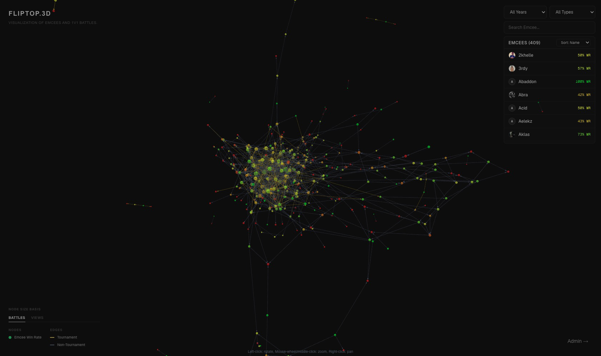
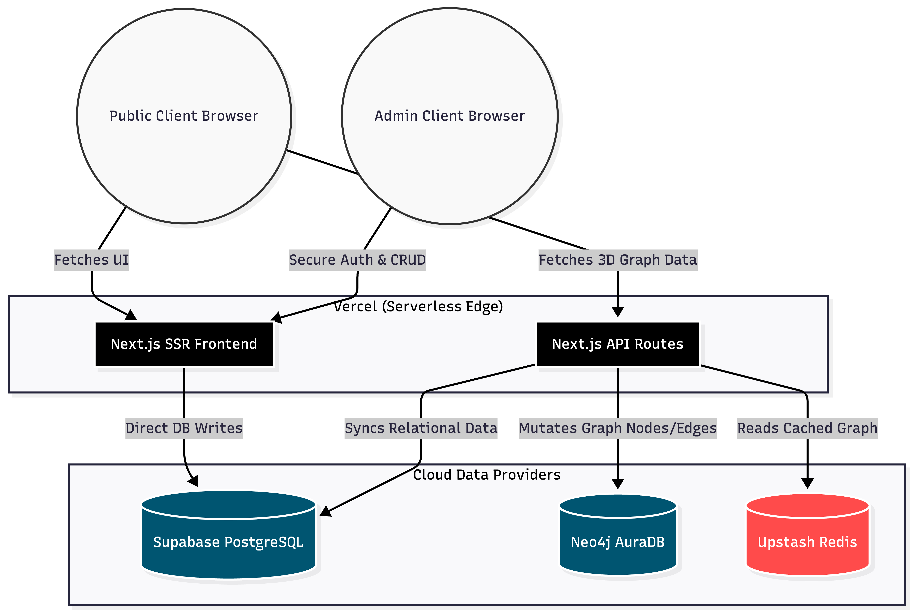
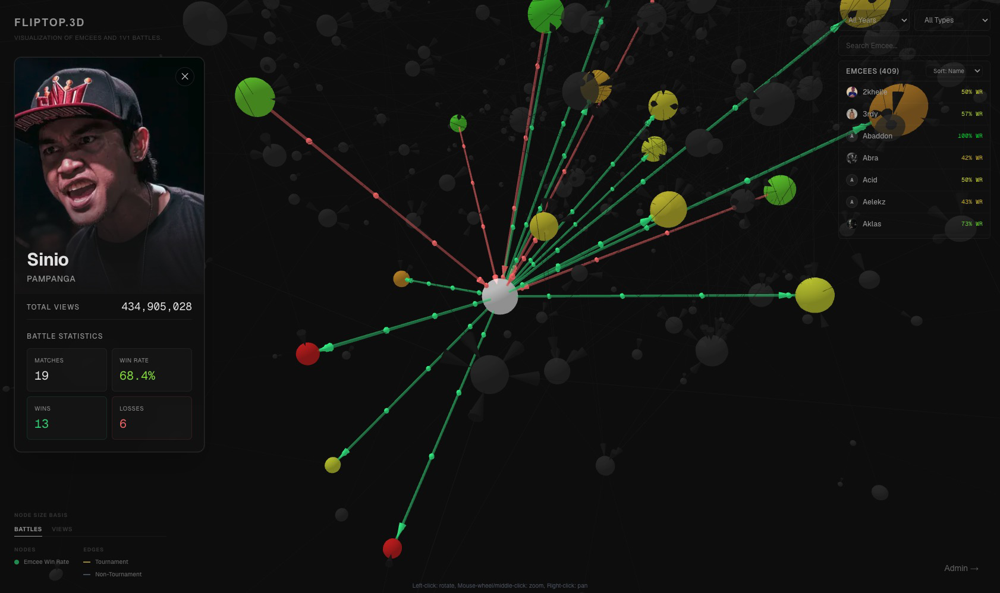
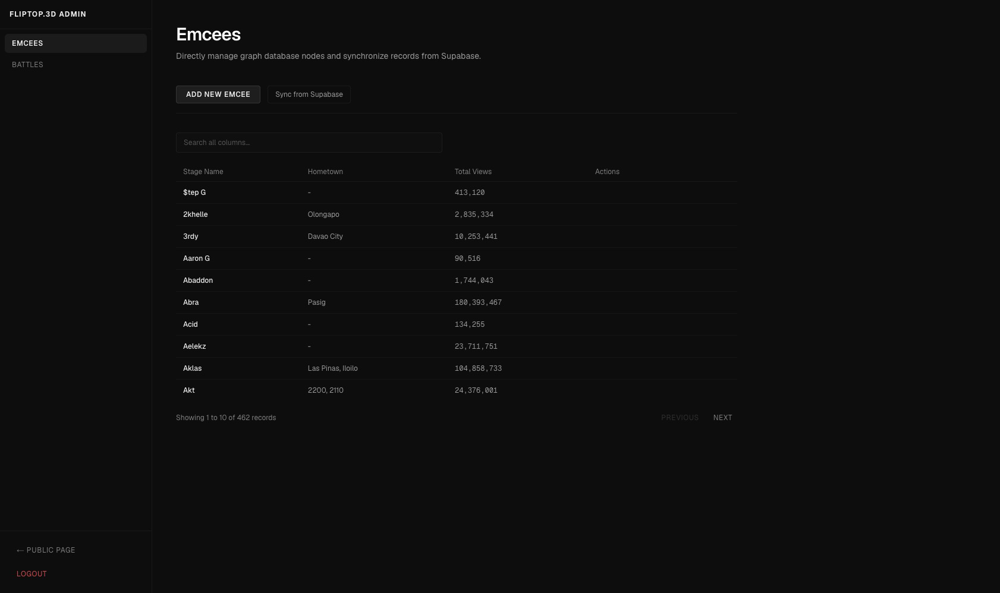

# fliptop.3d: A Graph-Based Visualization of Battle Rap Networks

**Repository:** [https://github.com/shansurat/fliptop.3d](https://github.com/shansurat/fliptop.3d)

---



## Introduction and Context

While the Fliptop Battle League may not be universally recognized in mainstream global media, it stands as a highly influential cultural phenomenon in the Philippines. Over the years, the league has generated a vast and intricate history of matchups, rivalries, and hierarchical standings among its participants (Emcees). 

This project posits that the complex, interconnected history of these battle outcomes serves as an exemplary use case for graph data structures. By modeling individual Emcees as vertices (nodes) and their battle outcomes as directed or undirected edges, this platform provides a novel, interactive methodology for observing league hierarchies, measuring network centrality, and visualizing historical battle paths that would otherwise be obscured in traditional tabular formats.

---

## Systems Analysis and Design (SAD)

For a comprehensive technical overview of the project, including database schemas, UML diagrams, and detailed architectural decisions, please refer to the official Systems Analysis and Design document:
- [SAD Documentation (PDF)](public/readme/docs.pdf)

---

## System Architecture and Data Structures

The system architecture utilizes a Command Query Responsibility Segregation (CQRS) inspired pattern to separate relational data storage from graph-based read models.



1. **Relational Source of Truth (Supabase/PostgreSQL):** Raw data pertaining to Emcee profiles and Battle outcomes are initially stored in normalized relational tables. This ensures data integrity and simplifies administrative data entry.
2. **Graph Read Model (Neo4j):** Data is synchronized into a Neo4j graph database. The schema is strictly defined:
   - **Nodes:** Represent `Emcee` entities.
   - **Edges:** Represent relationships. A `DEFEATED` edge is directed from the victor to the defeated, while a `BATTLED` edge is bidirectional, representing a draw or an unjudged promotional match.
3. **Caching Layer (Upstash Redis):** To optimize performance, the server executes complex Cypher traversal queries against Neo4j and caches the resulting JSON payloads in Redis, facilitating near-instantaneous 3D client rendering.

---

## Key Technical Features

- **Interactive 3D Graph Rendering:** Utilizes WebGL (via `react-force-graph-3d` and Three.js) to map the parsed graph data into a spatial physics-based layout.
- **Degree Centrality Visualization:** The rendering algorithm dynamically scales node sizes based on an Emcee's total number of edges (battle count). This visualizes a structural hierarchy, instantly distinguishing veteran participants from newcomers.
- **Node-Specific Subgraph Highlighting:** Selecting a node triggers a UI overlay containing the Emcee's aggregated statistics and dims all unrelated edges in the 3D space to emphasize the selected entity's direct battle network.
  
  

- **Administrative Synchronization Module:** A secure dashboard that allows users to perform CRUD operations on the relational database and subsequently execute synchronization routines that map the relational data into graph structures (`MERGE` operations).

  

---

## Technical Stack

- **Frontend Environment:** Next.js 16 (App Router), React 19, Tailwind CSS v4.
- **Visualization Library:** `react-force-graph-3d` layered over Three.js.
- **Databases:** Supabase (PostgreSQL) and Neo4j.
- **Cache Mechanism:** Upstash Redis.

---

## Local Environment Setup

The following instructions outline the procedure to establish the local development environment.

### 1. Prerequisites
Ensure that Node.js (version 20 or higher recommended) and a package manager (npm or yarn) are installed on the host machine.

### 2. Repository Initialization
Clone the repository and enter the project directory:
```bash
git clone https://github.com/shansurat/fliptop.3d.git
cd fliptop.3d
```

### 3. Dependency Installation
Install the required packages defined in the project configuration:
```bash
npm install
```

### 4. Environment Configuration
Create a `.env.local` file in the root directory. This file must contain the necessary connection strings and authentication keys for the database and caching services.

```env
# Relational Database (Supabase)
NEXT_PUBLIC_SUPABASE_URL=<your_supabase_url>
NEXT_PUBLIC_SUPABASE_ANON_KEY=<your_supabase_anon_key>

# Graph Database (Neo4j)
NEO4J_URI=<your_neo4j_uri>
NEO4J_USERNAME=<your_neo4j_username>
NEO4J_PASSWORD=<your_neo4j_password>

# Caching Layer (Upstash Redis)
UPSTASH_REDIS_REST_URL=<your_upstash_url>
UPSTASH_REDIS_REST_TOKEN=<your_upstash_token>
```

### 5. Execution
Start the Next.js development server:
```bash
npm run dev
```
- Access the 3D visualization interface via `http://localhost:3000`.
- Access the administrative synchronization module via `http://localhost:3000/admin`.
